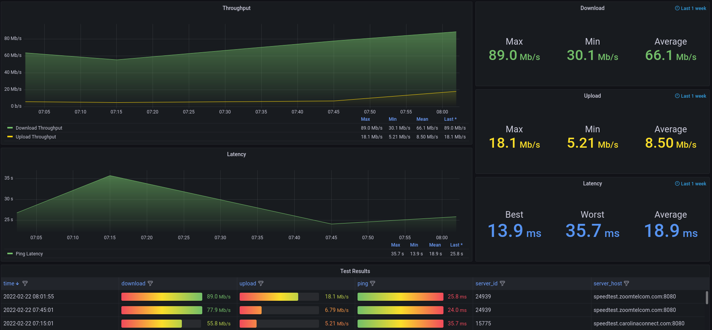

# Speedtest All-In-One

Automatically capture your Ookla Speedtest metrics and display them in a Grafana dashboard.

## Getting Started

### About This Code
This script was written to track internet speed using Ookla's speed test.

This repository contains everything necessary to build your own Speedtest dashboard (Python script, SQLite database, Grafana dashboard).

Dashboard and Database data is persistent through the use of Docker Volumes.

### Prerequisites
* Docker; Verified to work with Docker version 24.0.6.
* Docker Compose; Verified to work with Docker Compose version 2.23.0 (Will not work with version 1.X.).
* Docker host must be able to access Docker Hub.

#### Python Libraries
* See [pyproject.toml](pyproject.toml)

### Instructions For Use
* Clone this repository.
* Modify the `crontab` file to adjust your test interval.  The default is 15 minutes.  Visit [crontab.guru](https://crontab.guru) for an example on cron scheduling syntax.
* Modify the thresholds in the Test Results panel in Grafana to match the values for your Internet connection.  The default is set to 75Mb/s down and 25Mb/s up (which happen to be my Internet speed).
  Edit the Test Results panel, goto the Overrides and change the Max values for all Overrides to fit your situation.  (This will change the gradient levels for download_throughput, upload_throughput and ping_latency.)

#### Docker Commands
_(All Docker commands must be run from the cloned directory or you must specify the path and filename to docker-compose.yml.)_

* To pull/build the necessary Docker images:

`docker-compose build`

* To run the application:

`docker-compose up -d`

* To stop the application:

`docker-compose down`

* To wipe out your dashboard data:

`docker-compose down` followed by `docker volume rm speedtest_aio_grafana-storage` and `docker volume rm speedtest_aio_speedtest-storage`

* To remove intermediate build images (no longer required after `docker-compose build`):

`docker image prune --filter "label=prune=true"`

#### Grafana
* Default username/password is admin/admin.
* You will be prompted to change your password upon first login.
* Access your Grafana dashboard via [http://localhost:3000](http://localhost:3000) OR replace `localhost` with the IP Address of the host.
* **WARNING:** This dashboard will be accessible to all hosts in the same subnet!

#### Support For Raspberry Pi
If you are installing this Docker image on a Raspberry Pi, you will need to use
the `Dockerfile-speedtest-RPi` created specifically for this purpose.

Edit the `docker-compose.yml` file and change the line from `dockerfile: Dockerfile-speedtest` 
to `dockerfile: Dockerfile-speedtest-RPi` before continuing with your `docker-compose build`.

## Acknowledgements
* Grafana dashboard layout borrowed from [speedtest_exporter](https://github.com/danopstech/speedtest_exporter).

## Authors
* **Aaron Melton** - *Author* - Aaron Melton <aaron@aaronmelton.com>
